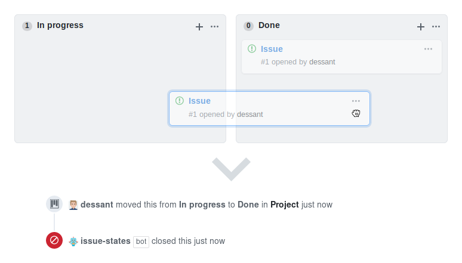

# Issue States

Issue States is a GitHub Action that closes or reopens issues
when they are moved to a project column.



## Supporting the Project

The continued development of Issue States is made possible
thanks to the support of awesome backers. If you'd like to join them,
please consider contributing with
[Patreon](https://armin.dev/go/patreon?pr=issue-states&src=repo),
[PayPal](https://armin.dev/go/paypal?pr=issue-states&src=repo) or
[Bitcoin](https://armin.dev/go/bitcoin?pr=issue-states&src=repo).

## Usage

1. Create the `.github/workflows/issue-states.yml` workflow file,
   use one of the [example workflows](#examples) to get started
2. Start adding or moving issues to the project columns declared
   in `open-issue-columns` and `closed-issue-columns`

Issues which were already in the respective columns before the action
was set up will not be processed. To process these issues,
move them to a different column, then move them back.

Care must be taken during the use of the action to not conflict
with project automation presets on GitHub.

### Inputs

The action can be configured using [input parameters](https://docs.github.com/en/actions/reference/workflow-syntax-for-github-actions#jobsjob_idstepswith).
All parameters are optional, except `github-token`.

<!-- prettier-ignore -->
- **`github-token`**
  - GitHub access token, value must be `${{ github.token }}` or an encrypted
    secret that contains a [personal access token](#using-a-personal-access-token)
  - Optional, defaults to `${{ github.token }}`
- **`open-issue-columns`**
  - Reopen issues that are moved to these project columns, value must be
    a comma separated list of project columns
  - Optional, defaults to `''`
- **`closed-issue-columns`**
  - Close issues that are moved to these project columns, value must be
    a comma separated list of project columns
  - Optional, defaults to `Closed, Done`

### Outputs

<!-- prettier-ignore -->
- **`issues`**
  - Issues that have been either closed or reopened, value is a JSON string
    in the form of `[{"owner": "actions", "repo": "toolkit", "issue_number": 1,
    "state": "closed"}]`, value of `state` is either `open` or `closed`

## Examples

The following workflow will close issues when they are moved
to the `Closed` or `Done` project column.

<!-- prettier-ignore -->
```yaml
name: 'Issue States'

on:
  project_card:
    types: [created, edited, moved]

permissions:
  repository-projects: read
  issues: write
  pull-requests: write

jobs:
  action:
    runs-on: ubuntu-latest
    steps:
      - uses: dessant/issue-states@v2
```

### Available input parameters

This workflow declares all the available input parameters of the action
and their default values. Any of the parameters can be omitted,
except `github-token`.

<!-- prettier-ignore -->
```yaml
name: 'Issue States'

on:
  project_card:
    types: [created, edited, moved]

permissions:
  repository-projects: read
  issues: write
  pull-requests: write

jobs:
  action:
    runs-on: ubuntu-latest
    steps:
      - uses: dessant/issue-states@v2
        with:
          github-token: ${{ github.token }}
          open-issue-columns: ''
          closed-issue-columns: 'Closed, Done'
```

### Using a personal access token

The action uses an installation access token by default to interact with GitHub.
You may also authenticate with a personal access token to perform actions
as a GitHub user instead of the `github-actions` app.

Create a [personal access token](https://docs.github.com/en/github/authenticating-to-github/keeping-your-account-and-data-secure/creating-a-personal-access-token)
with the `repo` or `public_repo` scopes enabled, and add the token as an
[encrypted secret](https://docs.github.com/en/actions/reference/encrypted-secrets#creating-encrypted-secrets-for-a-repository)
for the repository or organization, then provide the action with the secret
using the `github-token` input parameter.

<!-- prettier-ignore -->
```yaml
    steps:
      - uses: dessant/label-actions@v2
        with:
          github-token: ${{ secrets.PERSONAL_ACCESS_TOKEN }}
```

## License

Copyright (c) 2018-2021 Armin Sebastian

This software is released under the terms of the MIT License.
See the [LICENSE](LICENSE) file for further information.
